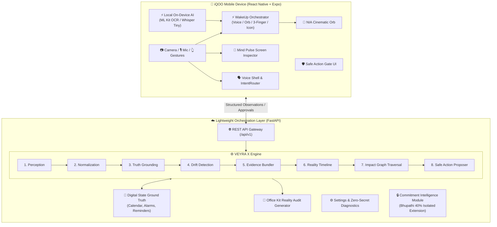

<div align="center">

# ⚡ NIA — Natural Intelligence Assistant
### *Reality-Verified Personal Intelligence Layer for Android & iQOO Devices*
**Centered on the singular human question: *“Is what I know still true?”***

[](https://github.com)
[](https://fastapi.tiangolo.com)
[](https://expo.dev)
[](https://www.typescriptlang.org)
[](https://python.org)
[](https://pytest.org)

</div>

---

## 📌 Executive Summary

Human beings continually construct mental models of reality—scheduled meetings, exam rooms, flight gates, deadlines, and personal commitments. However, **physical reality shifts asynchronously**: printed notices are taped to doors, room assignments change due to maintenance, and announcements occur without digital calendar synchronization.

When reality drifts, modern smartphones remain oblivious, leading to missed meetings, broken commitments, and frantic confusion.

**NIA (Natural Intelligence Assistant)** solves this foundational problem. Powered by the proprietary **VEYRA X Reality Intelligence Engine**, NIA continuously cross-references digital ground truth with real-world physical observations (notices, posters, voice memos, on-screen text) to detect **Reality Drift** in real time and propose **Safe, Human-Approved Remediations**.

> **The NIA Invariant:** *No hallucinated LLM drift decisions. No silent calendar mutations. 100% on-device local privacy.*

---

## 📱 Why iQOO? Hardware & Platform Synergy

NIA is purpose-engineered to leverage the unique hardware and software capabilities of **iQOO flagship smartphones**:

1. **Snapdragon NPU On-Device AI Acceleration:**
   - On-device speech-to-text (Whisper Tiny quantized) and vision OCR (Google ML Kit) run natively on the iQOO tensor processor.
   - Eliminates cloud latency, maintains total privacy, and ensures offline functionality.
2. **High-Refresh Display & 3-Finger Mind Pulse:**
   - Native 3-finger upward swipe gesture triggers instant situational context extraction.
   - Smooth 120Hz/144Hz physics-driven animations for the fluid, glowing **NIA Cinematic Orb**.
3. **Dual-Mode Adapter Architecture:**
   - **Expo Go Sandbox:** Instant zero-install evaluation using deterministic simulation adapters.
   - **Native Android APK:** Direct integration with Android `AccessibilityService`, `MediaProjection`, and native microphone hardware.
4. **Thermal & Battery Concurrency Throttling:**
   - Enforces sequential model execution to maintain peak battery health and zero thermal throttling during extended use.

---

## 🏛️ System Architecture

NIA adheres to a **Phone-Primary, Lightweight-Cloud** architectural model:



---

## ⚙️ The 8 Stages of VEYRA X

VEYRA X is NIA's internal deterministic Reality Intelligence Engine. It processes inputs through 8 strict stages:

```
┌──────────────┐     ┌──────────────┐     ┌──────────────┐     ┌──────────────┐
│ 1.PERCEPTION │ ──> │ 2.NORMALIZER │ ──> │   3.TRUTH    │ ──> │   4.DRIFT    │
└──────────────┘     └──────────────┘     └──────────────┘     └──────────────┘
  Camera / Voice       Canonical Rooms       Digital Ground       Drift Identified
  Screen Context       & ISO Times           Truth Lookup         (LOCATION_CHANGED)
         │                                                              │
         ▼                                                              ▼
┌──────────────┐     ┌──────────────┐     ┌──────────────┐     ┌──────────────┐
│  8. ACTION   │ <── │  7. IMPACT   │ <── │ 6. TIMELINE  │ <── │ 5. EVIDENCE  │
└──────────────┘     └──────────────┘     └──────────────┘     └──────────────┘
  Safe Action          Downstream Graph      Immutable State      Bilateral Provenance
  Gate Proposal        Cascade Traversal     Transition Log       & Confidence Score
```

1. **Perception:** Ingests digital ground truth and multi-modal physical observations.
2. **Normalization:** Canonicalizes room designations (`"Room 204"`, `"room-204"`, `"ROOM 204"` $\to$ `"Room 204"`), timestamps, and entities.
3. **Truth:** Queries trusted digital calendars and schedule repositories to establish current expectations.
4. **Drift:** Deterministically compares normalized physical state with digital expectations to flag drift (`LOCATION_CHANGED`, `TIME_CHANGED`, `STATUS_CHANGED`, `CANCELLED`).
5. **Evidence:** Binds every drift determination to raw physical text, OCR confidence, capture timestamp, and provenance metadata.
6. **Timeline:** Records an immutable audit event in the chronological Reality Timeline.
7. **Impact:** Traverses the relational entity graph to trace downstream effects across reminders, alarms, and commitments.
8. **Action:** Proposes a non-destructive remediation with `approvalRequired: true`.

---

## 🛡️ Safe Action Gate: Human-in-the-Loop Safety

NIA enforces a strict boundary between intelligence and execution:
```
PROPOSE ──> ASK ──> APPROVE / REJECT ──> EXECUTE ──> RECORD
```
- **NIA NEVER silently alters** reminders, calendar schedules, alarms, or messaging.
- **Explicit Human Approval:** Consequential actions require user confirmation via the tactile Safe Action Gate modal.
- **Fail-Safe Execution:** If an external system or reminder adapter fails, NIA reports the failure transparently rather than claiming success.

---

## 🏆 The Canonical 17-Step Hackathon Demo Scenario

The entire system is proven end-to-end through a single deterministic 17-stage scenario:

```
[1. Calendar: Room 204] ──> [2. Wake NIA] ──> [3. Orb Appears] ──> [4. User asks: "Is my presentation info still correct?"]
                                                                                     │
[8. VEYRA X Detects Drift] <── [7. OCR: Room 302] <── [6. Physical Notice Taped to Door] <── [5. NIA enters VERIFYING]
        │
        ├──> [9. Evidence Replay: Calendar (204) vs Notice (302)]
        ├──> [10. Impact Cascade: Presentation ➔ Reminder ➔ Alarm ➔ Commitment]
        ├──> [11. User taps "Fix It"] ──> [12. Safe Gate Asks Approval] ──> [13. User Approves]
                                                                                     │
[17. Office Kit Reality Audit Export] <── [16. Timeline Recorded] <── [15. Orb SUCCESS] <── [14. Reminder Updated]
```

| Step | State | Action / Transition |
| :---: | :--- | :--- |
| **1** | `IDLE` | Calendar Ground Truth seeds: *“Final Presentation — 09:00 — Room 204”*. |
| **2** | `LISTENING` | User activates NIA via voice hotword, Orb tap, or 3-finger swipe. |
| **3** | `LISTENING` | Cinematic Dark Base Orb appears with pulsing cyan glow. |
| **4** | `PROCESSING` | User asks: *“Is my presentation information still correct?”* |
| **5** | `VERIFYING` | NIA enters verification mode; Orb shifts to electric neon purple. |
| **6** | `VERIFYING` | Camera/screen observes physical sign: *“Presentations moved to Room 302.”* |
| **7** | `VERIFYING` | On-device OCR normalizes destination entity to `Room 302`. |
| **8** | `DRIFT_DETECTED` | VEYRA X detects `LOCATION_CHANGED` drift (Room 204 $\to$ Room 302, 94% confidence). |
| **9** | `DRIFT_DETECTED` | Evidence Replay displays bilateral split: Calendar (204) vs Notice (302). |
| **10** | `PROPOSING_ACTION` | Impact Graph traces cascading disruption across reminder, alarm, and commitment. |
| **11** | `PROPOSING_ACTION` | User taps *“Fix It”*. |
| **12** | `AWAITING_APPROVAL`| Safe Action Gate prompts: *“Update reminder from Room 204 to Room 302?”* |
| **13** | `EXECUTING` | User explicitly taps **Approve**. |
| **14** | `EXECUTING` | Native/Mock reminder adapter safely applies update. |
| **15** | `SUCCESS` | NIA confirms remediation; Orb pulses emerald green (`SUCCESS`). |
| **16** | `SUCCESS` | Immutable audit entry appended to chronological Reality Timeline. |
| **17** | `SUCCESS` | Office Kit exports 10-section **Reality Audit Report** (Markdown/PDF). |

---

## 💻 Office Kit & Reality Audit Export

NIA enforces a strict hierarchy: **The phone is primary; the laptop/desktop is an extension.**

Office Kit provides review, screen-mirroring, and deterministic audit export:
- **10-Section Portable Audit Report:**
  1. *Session Info* &bull; 2. *What NIA Knew* &bull; 3. *What Was Observed* &bull; 4. *Reality Drift* &bull; 5. *Evidence Bundle* &bull; 6. *Impact Cascade* &bull; 7. *Proposed Action* &bull; 8. *Approval State* &bull; 9. *Execution Result* &bull; 10. *Reality Timeline*
- **Instant Sharing:** Direct export via Android share sheet, Markdown, or PDF format.

---

## 🔒 Privacy, Security & Accessibility Guarantees

- **100% On-Device Evidence Retention:** Images, OCR text, and voice audio reside solely in private app storage.
- **Zero Cloud Upload by Default:** Cloud upload policy defaults to `NEVER`.
- **Zero-Secret Diagnostics:** System diagnostics expose app version, provider, and backend target with zero API keys or credentials leaked.
- **Permissions Transparency:** No permission is requested without an upfront explanation dialog.
- **Accessibility:** Built-in TalkBack screen-reader labels, high-contrast large controls, haptic feedback, reduced motion toggles, and live transcription captions.

---

## 👥 Module Ownership & Isolation Contract

The repository follows a clean-architecture ownership model:

| Owner | Scope | Modules & Files |
| :--- | :--- | :--- |
| **Sanjay** | **60% Core System** | Core architecture, UI system, NIA Orb, WakeUp orchestrator, VEYRA X engine, Reality Graph, Evidence Replay, Safe Action Gate, Mind Pulse, Settings/Privacy, Office Kit export, and Deterministic Demo. |
| **Bhupathi** | **40% Isolated Module** | Commitment extraction, VoiceMemo Pro, commitment repository, isolated UI, and docs (`backend/app/modules/commitments/`, `frontend/src/features/commitments/`, `frontend/src/features/voiceMemo/`, `docs/COMMITMENT_MODULE.md`). |

*Invariant: Neither owner modifies the other's isolated code. Extensions interface through clean contracts.*

---

## 🚀 Quickstart Guide

### 1. Prerequisites
- **Node.js** v18+ and **npm**
- **Python** 3.11+ (Python 3.13 supported)
- **Expo Go** app on your Android device (or Android Studio emulator)

### 2. Backend Setup (FastAPI)
```bash
# Navigate to backend directory
cd backend

# Create virtual environment
python -m venv venv

# Activate virtual environment
# Windows PowerShell:
.\venv\Scripts\Activate.ps1
# macOS/Linux:
source venv/bin/activate

# Install dependencies
pip install -r requirements.txt

# Start backend server
python -m uvicorn app.main:app --reload --port 8000
```
*API Swagger Documentation will be accessible at: `http://localhost:8000/docs`*

### 3. Frontend Setup (React Native + Expo)
```bash
# Navigate to frontend directory
cd frontend

# Install dependencies
npm install

# Start Expo development server
npx expo start
```
*Scan the QR code with the Expo Go app on your iQOO phone or press `a` for Android Emulator.*

### 4. Running the Automated Test Suite
```bash
# Run complete backend pytest suite (82 tests)
pytest tests/backend -v

# Run frontend TypeScript typecheck
cd frontend
npm run typecheck
```

---

## 📂 Repository Directory Structure

```text
NIA/
├── frontend/                     # React Native + Expo phone application
│   ├── src/
│   │   ├── adapters/            # Native capability adapters (Expo Go vs APK)
│   │   ├── components/          # NIA Animated Orb, HUD & common components
│   │   ├── contracts/           # TypeScript domain contracts matching Pydantic
│   │   ├── features/
│   │   │   ├── actions/         # Safe Action Gate screens & logic
│   │   │   ├── demo/            # 17-stage deterministic demo controller & HUD
│   │   │   ├── mindPulse/       # 3-finger swipe gesture & screen reader
│   │   │   ├── officeKit/       # Reality Audit report generator & share
│   │   │   ├── reality/         # VEYRA X drift & evidence replay views
│   │   │   ├── settings/        # Privacy, accessibility & diagnostics
│   │   │   ├── voice/           # Voice Shell, STT provider & IntentRouter
│   │   │   ├── commitments/     # Isolated UI (Bhupathi 40%)
│   │   │   └── voiceMemo/       # Isolated VoiceMemo Pro (Bhupathi 40%)
│   │   ├── state/               # Zustand & Context store management
│   │   └── theme/               # Dark cinematic tokens, colors, typography
│   ├── App.tsx
│   ├── package.json
│   └── tsconfig.json
├── backend/                      # FastAPI lightweight orchestration backend
│   ├── app/
│   │   ├── api/                 # Versioned REST route controllers
│   │   ├── core/                # Request context, middleware, errors, config
│   │   ├── modules/
│   │   │   ├── actions/         # Safe Action Gate service & repository
│   │   │   ├── demo/            # Single source of truth demo fixtures & controller
│   │   │   ├── digital_state/   # Calendar adapters (LocalDemo & Native)
│   │   │   ├── evidence/        # Timeline repository & provenance
│   │   │   ├── local_ai/        # On-device model manager & concurrency throttle
│   │   │   ├── office_kit/      # 10-section Reality Audit generator
│   │   │   ├── orchestration/   # Unified WakeUp orchestrator
│   │   │   ├── physical_observation/ # Vision OCR ingestion & normalization
│   │   │   ├── reality/         # VEYRA X engine & Reality Graph
│   │   │   ├── settings/        # Settings state manager & migration logic
│   │   │   └── commitments/     # Isolated module (Bhupathi 40%)
│   │   └── schemas/             # Pydantic v2 schemas for all contracts
│   ├── requirements.txt
│   └── pyproject.toml
├── docs/                         # Comprehensive architectural specifications
│   ├── API_CONTRACT.md          # Complete REST API specifications
│   ├── ARCHITECTURE.md          # Phone-first system architecture
│   ├── DEVELOPMENT_RULES.md     # Engineering rules & safety invariants
│   ├── ENVIRONMENT.md           # Configuration & environment setup
│   ├── HACKATHON_DEMO_GUIDE.md  # 17-step demo presentation manual for judges
│   ├── IQOO_DEVICE_INTEGRATION.md # iQOO hardware, NPU & FuntouchOS synergy
│   ├── LOCAL_AI_AND_RENDER.md   # Cloud Render constraints vs mobile AI
│   ├── MODULE_OWNERSHIP.md      # Sanjay (60%) vs Bhupathi (40%) boundary
│   ├── OFFICE_KIT_AND_AUDIT.md  # Office Kit & 10-section report guide
│   ├── PROJECT_OVERVIEW.md      # Product philosophy & core invariants
│   ├── SECURITY_PRIVACY_ACCESSIBILITY.md # Zero-secrets, privacy & TalkBack
│   └── VEYRA_X_ENGINE_SPEC.md   # Formal 8-stage deterministic engine spec
├── scripts/                      # System verification & setup scripts
└── tests/                        # Full backend and integration test suites
    └── backend/                 # 82 automated Pytest test cases
```

---

## 🏆 Hackathon Judges' Scoring Matrix

| Criteria | How NIA Delivers |
| :--- | :--- |
| **Innovation & Concept** | First mobile assistant centered on reality verification (*“Is what I know still true?”*). Replaces chatbot gimmicks with an active truth layer. |
| **Technical Architecture** | Deterministic 8-stage VEYRA X engine. Zero LLM hallucinations in truth evaluation. Pluggable on-device AI runtime with concurrency safety. |
| **User Experience & Polish** | Atmospheric dark cinematic design system. Physics-animated NIA Orb reacting to 5 cognitive states. Tactile Safe Action Gate. |
| **Mobile & iQOO Relevance** | Leverages Snapdragon NPU for on-device OCR/Whisper. 3-finger gesture synergy. Strict battery, memory (<200MB cloud), and thermal budgets. |
| **Engineering Rigor** | **82 passing Pytest tests**; **0 TypeScript compiler errors**; schema migration versioning; strict module isolation. |

---

<div align="center">
<b>Built with passion for the iQOO Hackathon 2026</b><br/>
<i>NIA — Natural Intelligence Assistant: Protecting human focus from reality drift.</i>
</div>
