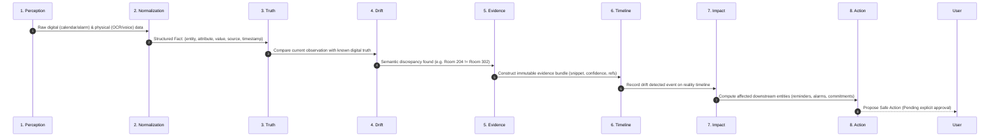
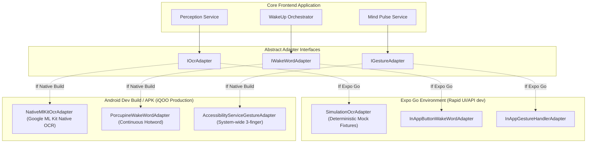

# NIA — System Architecture

## 1. High-Level System Architecture

NIA is architected as a **Phone-First Distributed Intelligence System**. Compute is split strategically between the mobile device (iQOO phone running React Native + Expo) and a lightweight cloud/local backend (FastAPI).

```mermaid
flowchart TB
    subgraph MobileDevice["Phone Native Intelligence Layer (iQOO Phone / Expo)"]
        Sensors[Camera / Audio / Gestures]
        WakeUp[WakeUp Orchestrator\n(Voice / Orb / 3-Finger / App)]
        Orb[NIA Orb UI Component]
        Adapters[Native Capability Adapters\n(ML Kit / MediaProjection / Fallbacks)]
        LocalEngine[Local Perception & Normalizer]
        ActionGate[Safe Action Gate Modal UI]
    end

    subgraph BackendCore["Lightweight Orchestration Layer (FastAPI)"]
        API[FastAPI Gateway]
        subgraph VeyraX["VEYRA X Engine"]
            Norm[Normalization Service]
            Truth[Truth & Drift Detector]
            Evid[Evidence Bundler]
            Graph[Impact Graph Traversal]
            ActionProp[Action Proposer]
        end
        StateRepo[Digital State Repository\n(Calendar, Reminders, Alarms)]
        TimelineRepo[Reality Timeline Repository]
        BhupathiModule[Commitment Intelligence Module\n(Bhupathi 40% Isolated)]
    end

    Sensors --> Adapters
    Adapters --> WakeUp
    WakeUp --> Orb
    Adapters --> LocalEngine
    LocalEngine -->|Observations + Context| API
    API --> Norm --> Truth --> Evid --> Graph --> ActionProp
    Truth <--> StateRepo
    ActionProp -->|ProposedAction (approvalRequired: true)| ActionGate
    ActionGate -->|User Approves| API
    API -->|Execute Safe Mutation| StateRepo
    API -->|Append Audit Event| TimelineRepo
```

---

## 2. The VEYRA X Reality Pipeline

VEYRA X is the internal deterministic reality engine. It processes events strictly across 8 consecutive stages:



1. **PERCEPTION:** Ingests raw inputs from digital sources (Google Calendar mock, local device storage) and physical sources (camera frames, OCR text, voice transcriptions).
2. **NORMALIZATION:** Maps unstructured observations into canonical schema: `entity`, `attribute`, `normalized_value`, `observed_at`, `confidence`, and `source_type`.
3. **TRUTH:** Retrieves the current active digital ground truth from the Digital State repository for the corresponding entity.
4. **DRIFT:** Evaluates equality and semantic compatibility. Flags drift types: `LOCATION_CHANGED`, `TIME_CHANGED`, `STATUS_CANCELLED`, `PERSONNEL_CHANGED`, or `FACT_CONTRADICTED`.
5. **EVIDENCE:** Assembles an evidence record containing references to raw images/transcripts, bounding boxes, OCR text, timestamps, and confidence scores.
6. **TIMELINE:** Appends an event to the chronological, append-only **Reality Timeline**.
7. **IMPACT:** Walks the entity dependency graph to uncover all connected nodes (e.g., travel-time alarms, related meetings, scheduled reminders, team commitments).
8. **ACTION:** Emits a `ProposedAction` payload with `approvalRequired: true`. The action remains inert until passed through the Safe Action Gate.

---

## 3. Frontend / Backend Boundary & Responsibilities

| Responsibility | Frontend (React Native + Expo) | Backend (FastAPI) |
| :--- | :--- | :--- |
| **User Interaction** | NIA Orb, Mind Pulse 3-finger swipe, Safe Action Gate UI, Evidence Replay viewer | None (Headless API) |
| **Hardware & Sensors** | Camera, microphone, gesture recognizers, haptic feedback | None |
| **Local Perception** | On-device OCR (ML Kit in Dev Build; mock adapter in Expo Go), audio recording | None |
| **Reality Intelligence** | Client-side optimistic cache, UI state transitions | VEYRA X pipeline (Normalization, Truth, Drift, Impact, Action Proposal) |
| **State Storage** | Local AsyncStorage / SecureStore for session & offline cache | Repository layer for Digital State, Evidence Items, Timeline, and Commitments |
| **Action Execution** | Renders approval UI, captures biometric/touch approval | Validates signature/approval token, executes mutation, logs to timeline |

---

## 4. Adapter Strategy: Expo Go vs. Development Build (APK)

Because React Native allows two distinct execution models, NIA utilizes the **Port-and-Adapter** pattern to guarantee continuous developer productivity without faking production behavior:



* **Expo Go:** Used for instant UI feedback, styling, component testing, navigation, and API integration. Uses explicit simulation fixtures clearly tagged as `[SIMULATED]`.
* **Android Dev Build / APK:** Used on the iQOO phone for hardware-accelerated local OCR, background accessibility triggers, and hotword listening.

---

## 5. Request / Response Lifecycle

1. **Client Ingestion:** User captures an image or audio memo on the phone.
2. **Local Perception:** Local adapter extracts raw text and metadata.
3. **Dispatch:** Frontend calls `POST /api/v1/reality/check` with `PhysicalObservation` and current user context.
4. **Backend Processing:**
   - Normalizes observation into structured facts.
   - Fetches active digital records matching entity.
   - VEYRA X evaluates drift. If drift exists:
     - Assembles `EvidenceItem` with cryptographic ID.
     - Computes downstream `ImpactItem` records.
     - Formulates `ProposedAction` marked `approvalRequired = True`.
5. **Client Rendering:**
   - NIA Orb transitions to `REALITY_DRIFT` alert state (amber/cyan pulse).
   - Safe Action Gate modal renders the proposal with Evidence Replay.
6. **User Decision:**
   - User reviews evidence and taps **Approve**.
   - Client sends `POST /api/v1/actions/{action_id}/approve`.
7. **Execution & Audit:**
   - Backend updates digital state.
   - Timeline appends `ACTION_EXECUTED` event.
   - Response confirms new ground truth.
