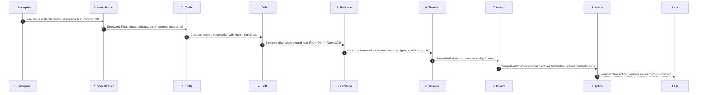
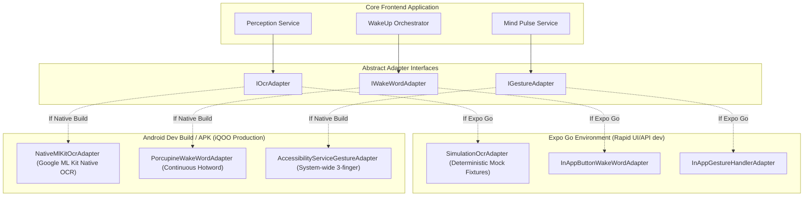

# NIA — System Architecture Specification
> **Comprehensive System Topology, Subsystems & Inter-Process Communication**

---

## 🏛️ 1. High-Level System Topology

NIA is architected as a **Phone-First Distributed Intelligence System**. Compute is strategically partitioned between the mobile device (iQOO phone running React Native + Expo) and a lightweight cloud/local backend (FastAPI).

```mermaid
flowchart TB
    subgraph MobileDevice["Phone Native Intelligence Layer (iQOO Phone / Expo)"]
        Sensors[Camera / Audio / Gestures]
        WakeUp[WakeUp Orchestrator\n(Voice / Orb / 3-Finger / App)]
        Orb[NIA Animated Cinematic Orb]
        VoiceShell[Voice Shell & IntentRouter]
        MindPulse[Mind Pulse 3-Finger Screen Inspector]
        SafeGate[Safe Action Gate Modal UI]
        DemoHUD[17-Step Deterministic Demo HUD]
        SettingsUI[Settings, Privacy & Accessibility]
        Adapters[Native Capability Adapters\n(ML Kit / MediaProjection / Fallbacks)]
        LocalEngine[Local Perception & Normalizer]
    end

    subgraph BackendCore["Lightweight Orchestration Layer (FastAPI)"]
        API[FastAPI Gateway (/api/v1)]
        subgraph VeyraX["VEYRA X Engine"]
            Norm[Normalization Service]
            Truth[Truth & Grounding Detector]
            Drift[Symbolic Drift Engine]
            Evid[Evidence Provenance Bundler]
            Graph[Impact Graph Traversal]
            ActionProp[Safe Action Proposer]
        end
        StateRepo[Digital State Repository\n(Calendar, Reminders, Alarms)]
        TimelineRepo[Reality Timeline Repository]
        OfficeKit[Office Kit 10-Section Audit Generator]
        SettingsMgr[Settings & Zero-Secret Diagnostics]
        DemoCtrl[Demo Scenario Controller & Fixtures]
        BhupathiModule[Commitment Intelligence Module\n(Bhupathi 40% Isolated Extension)]
    end

    Sensors --> Adapters
    Adapters --> WakeUp
    WakeUp --> Orb
    Sensors --> VoiceShell
    Sensors --> MindPulse
    Adapters --> LocalEngine
    LocalEngine -->|Observations + Context| API
    API --> Norm --> Truth --> Drift --> Evid --> Graph --> ActionProp
    Truth <--> StateRepo
    ActionProp -->|ProposedAction (approvalRequired: true)| SafeGate
    SafeGate -->|Explicit Human Approval| API
    API -->|Execute Safe Mutation| StateRepo
    API -->|Append Audit Event| TimelineRepo
    API --> OfficeKit
    API --> SettingsMgr
    API --> DemoCtrl
```

---

## ⚙️ 2. The 8 Stages of VEYRA X

VEYRA X is the internal deterministic reality engine. It processes events strictly across 8 consecutive stages:



1. **PERCEPTION:** Ingests raw inputs from digital sources (Google Calendar mock, local device storage) and physical sources (camera frames, OCR text, voice transcriptions).
2. **NORMALIZATION:** Maps unstructured observations into canonical schema: `entity`, `attribute`, `normalized_value`, `observed_at`, `confidence`, and `source_type`.
3. **TRUTH:** Retrieves the current active digital ground truth from the Digital State repository for the corresponding entity.
4. **DRIFT:** Evaluates equality and semantic compatibility. Flags drift types: `LOCATION_CHANGED`, `TIME_CHANGED`, `STATUS_CANCELLED`, `PERSONNEL_CHANGED`, or `FACT_CONTRADICTED`.
5. **EVIDENCE:** Assembles an evidence record containing references to raw images/transcripts, bounding boxes, OCR text, timestamps, and confidence scores.
6. **TIMELINE:** Appends an event to the chronological, append-only **Reality Timeline**.
7. **IMPACT:** Walks the entity dependency graph to uncover all connected nodes (e.g., travel-time alarms, related meetings, scheduled reminders, team commitments).
8. **ACTION:** Emits a `ProposedAction` payload with `approvalRequired: true`. The action remains inert until passed through the Safe Action Gate.

---

## 📱 3. Subsystem Breakdown

### 3.1 Voice Interaction Shell (`frontend/src/features/voice/`)
- **Pipeline:** Wake Word / Mic $\to$ `STTProvider` $\to$ Transcript $\to$ `IntentRouter` $\to$ Orchestrator.
- **Intents Supported:** `NEXT_MEETING`, `VERIFY_INFORMATION`, `WHAT_CHANGED`, `WHY`, `WHAT_AFFECTS`, `FIX_IT`, `CANCEL`, `HELP`.
- **Text/Voice Parity:** The same intent router processes typed text commands for testing environments without working microphones.
- **Bhupathi Isolation Invariant:** Queries matching "commitment" or "promise" route strictly to the isolated `COMMITMENT_EXTRACT` extension point with zero competing commitment schemas.

### 3.2 Mind Pulse Screen Verification (`frontend/src/features/mindPulse/`)
- **Concept:** 3-finger upward swipe $\to$ capture active screen $\to$ extract visible entities $\to$ compare against NIA ground truth $\to$ render confirmation or drift badge.
- **Sandbox vs. Native:** In Expo Go, simulated screen content verifies the UX. In native builds, Android `AccessibilityService` or `MediaProjection` extracts live view hierarchy text.

### 3.3 Office Kit & Reality Audit (`backend/app/modules/office_kit/`)
- **Principle:** Phone is the primary capture device; laptop is an extension for review and export.
- **10-Section Report:** Generates portable Markdown/PDF containing session details, ground truth, observation, drift classification, evidence bundle, impact cascade, safe action, user approval, execution result, and timeline.

### 3.4 Settings, Privacy & Diagnostics (`backend/app/modules/settings/`)
- **100% On-Device Local Processing:** Evidence, images, and audio reside on-device. Cloud upload policy defaults to `NEVER`.
- **Zero-Secret Diagnostics:** System diagnostics introspection returns backend target, model status, and capability info without leaking API keys or credentials.
- **Schema Migration Versioning:** Automatically migrates legacy settings states without corrupting user preferences.

### 3.5 17-Step Deterministic Demo System (`backend/app/modules/demo/`)
- **Single Source of Truth:** Centralized fixtures prevent scattered hardcoded strings.
- **Controller:** Supports step-forward, step-backward, direct jumping (steps 1..17), autoplay, and complete scenario reset.

---

## 🔌 4. Adapter Strategy: Expo Go vs. Development Build (APK)

Because React Native allows two distinct execution models, NIA utilizes the **Port-and-Adapter** pattern:


