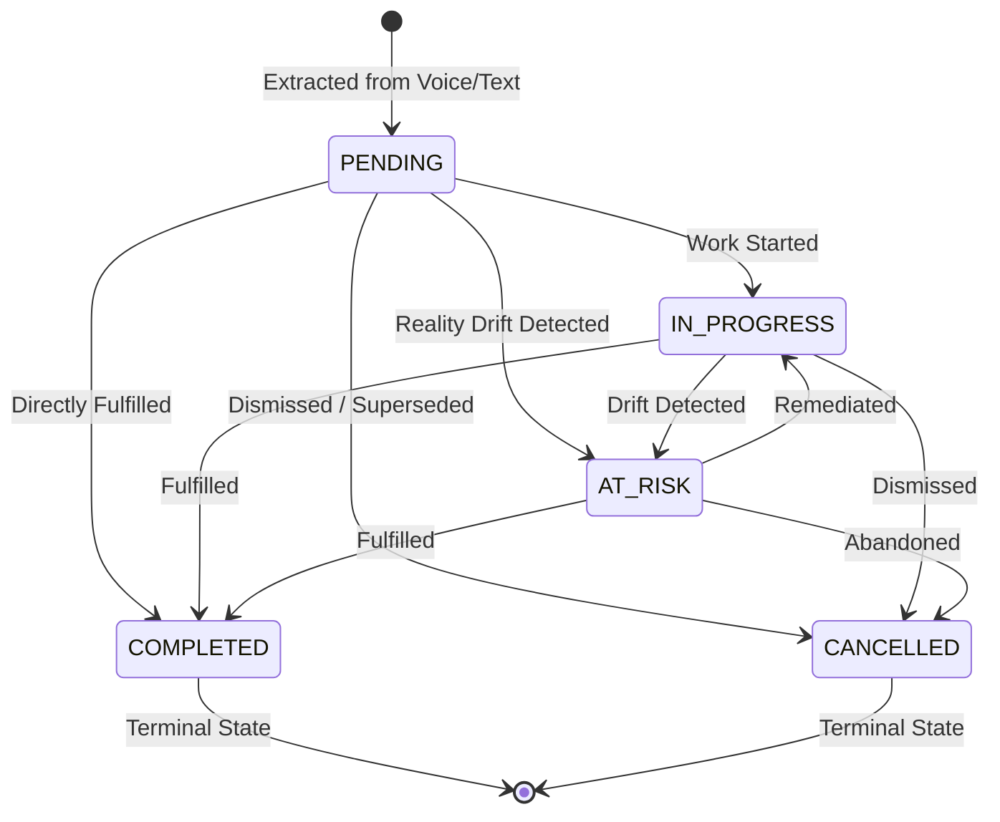

# NIA — Commitment Intelligence & VoiceMemo Pro Module
> **Document Version:** 2.0 (Post-Implementation Architecture & Integration Guide)  
> **Module Owner:** Bhupathi (40% Isolated Module)  
> **Core Architecture Owner:** Sanjay (60% Platform & Reality Engine)  
> **Integration Status:** Ready for Merge Package (Verification: 121/121 backend tests passed, frontend typecheck clean, 0 core conflicts)  

---

## 1. Purpose & Guiding Principle

The **Commitment Intelligence** module converts spoken voice memos, meeting minutes, and conversational transcripts into structured, verifiable, and provenance-backed commitments.

> [!IMPORTANT]
> **Boundary Principle:**  
> **“Commitment Intelligence extracts and tracks commitments. VEYRA X owns reality verification.”**

Unlike generic productivity task managers:
- Every commitment is anchored to raw conversational or auditory evidence (`evidence_ref`).
- Commitments are context-aware, binding to digital calendar events, physical locations, and counterparties.
- When physical observations contradict scheduled realities (e.g. room changes), the module does not invent drift logic; rather, it exposes structured query adapters that Sanjay's VEYRA X queries to identify downstream at-risk commitments.
- **Strict Safe Action Gate Compliance:** Follow-up proposals are strictly proposal-only (`requires_approval = True`). The module **never** automatically dispatches external SMS, WhatsApp, or emails.

---

## 2. Ownership & Scope Matrix

| Component Layer | Bhupathi (Isolated 40%) | Sanjay (Core 60%) |
| :--- | :--- | :--- |
| **Backend Code** | `backend/app/modules/commitments/` | `backend/app/main.py`, `backend/app/api/router.py`, `backend/app/schemas/` |
| **Extraction Engine**| Rule-based & optional on-device Local SLM | Pluggable local AI manager (`manager.py`) |
| **Persistence** | `InMemoryCommitmentRepository` | SQLite / PostgreSQL ground truth storage |
| **Reality Verification**| `CommitmentRealityAdapter` (Consumer) | VEYRA X Drift Engine, Impact Graph |
| **Action Execution** | `FollowUpProposal` (Proposal Only) | Safe Action Gate (`actions_service`) |
| **Frontend Code** | `frontend/src/features/voiceMemo/`, `frontend/src/features/commitments/` | Global navigation, NIA Orb, global theme |
| **Documentation** | `docs/COMMITMENT_MODULE.md` | Core docs, README, API contracts |

---

## 3. Directory Structure

```text
NIA-Natural-Intelligence-Assistant/
├── backend/app/modules/commitments/
│   ├── __init__.py           # Unified exports for the module
│   ├── schemas.py            # Pydantic v2 schemas and compatibility adapters
│   ├── extractor.py          # Deterministic rule-based extraction engine
│   ├── repository.py         # In-memory repository with lifecycle state transitions
│   ├── service.py            # Core domain service orchestrating extraction & CRUD
│   ├── router.py             # Isolated FastAPI endpoints (/commitments)
│   ├── adapter.py            # Reality Graph & VEYRA X integration adapter
│   ├── proposals.py          # Proposal-only follow-up recommendation service
│   └── providers.py          # Composite provider with Local LLM & fallback policy
├── frontend/src/features/
│   ├── voiceMemo/
│   │   ├── types.ts          # VoiceMemoState and session contracts
│   │   ├── useVoiceMemo.ts   # Audio capture, timer, and extraction hook
│   │   ├── RecordingIndicator.tsx       # Waveform visualizer and live timer
│   │   ├── TranscriptPreview.tsx        # Spoken text & provenance preview
│   │   ├── CommitmentExtractionPreview.tsx # Extracted items with confidence badges
│   │   ├── VoiceMemoErrorState.tsx      # Structured user-facing error card
│   │   ├── VoiceMemoRecorder.tsx        # Master composite recording container
│   │   └── index.ts          # Re-exports
│   └── commitments/
│       ├── types.ts          # CommitmentItem and filter interfaces
│       ├── useCommitments.ts # Data fetching, filtering, and mutation hook
│       ├── CommitmentStatusBadge.tsx    # Multi-modal status badge (icon + label)
│       ├── CommitmentSourceBadge.tsx    # Source modality indicator
│       ├── CommitmentConfidence.tsx     # Tiered confidence meter
│       ├── CommitmentEmptyState.tsx     # Themed empty state
│       ├── CommitmentCard.tsx           # Interactive cinematic card
│       ├── CommitmentDetail.tsx         # Modal sheet for editing & linking
│       ├── CommitmentList.tsx           # Tabbed list with filter controls
│       ├── index.ts          # Re-exports
│       └── __tests__/
│           └── commitments_ui.test.ts   # Contract verification tests
└── tests/backend/
    └── test_commitments.py   # 39 module tests (Extraction, Repo, API, Adapter, LLM)
```

---

## 4. Domain Model (`Commitment`)

| Field | Type | Validation / Invariant |
| :--- | :--- | :--- |
| `id` | `str` | Stable unique ID (e.g. `cmt-9f8a12bc`), non-empty. |
| `owner` | `str` | Person responsible, non-empty. Default: `"current_user"`. |
| `action` | `str` | Commitment action description, non-empty, capitalized. |
| `deadline` | `Optional[str]` | Normalized string or relative expression. **Never fabricated**. |
| `source` | `CommitmentSource` | Enum: `CONVERSATION`, `MEETING_TRANSCRIPT`, `VOICE_MEMO`, `IMPORTED_TEXT`, `DEMO`. |
| `status` | `CommitmentStatus` | Enum: `PENDING`, `IN_PROGRESS`, `COMPLETED`, `CANCELLED`, `AT_RISK`. |
| `confidence` | `float` | Range `[0.0, 1.0]`. Represents extraction certainty. |
| `createdAt` | `datetime` | UTC timestamp of creation. |
| `updatedAt` | `datetime` | UTC timestamp of latest update. |
| `relatedEventId` | `Optional[str]` | Foreign key to calendar / digital state event. |
| `relatedLocation`| `Optional[str]` | Physical room or venue (e.g., `"Room 204"`). |
| `evidenceRef` | `Optional[str]` | Pointer to audio file or transcript evidence ID. |
| `evidence` | `Optional[CommitmentEvidence]` | Embedded quote, character offsets, and speaker attribution. |
| `metadata` | `Dict[str, Any]`| Arbitrary context, at-risk diagnostic reasons, and provider info. |

### Core Contract Compatibility Adapter
Bhupathi's domain model includes `to_core_commitment()` mapping to Sanjay's shared `app.schemas.commitment.Commitment`:
- `id` $\to$ `commitment_id`
- `action` $\to$ `title`
- `owner` $\to$ `counterparty`
- `status` $\to$ `OPEN` (`PENDING`/`IN_PROGRESS`), `COMPLETED` (`COMPLETED`), `OVERDUE` (`AT_RISK`), `DISMISSED` (`CANCELLED`).

---

## 5. Lifecycle Status Transitions



Invalid transitions (such as transitioning from terminal `COMPLETED` back to `PENDING`) raise `InvalidStatusTransitionException` (HTTP 400).

---

## 6. Extraction Rules & Confidence Semantics

### 6.1 Pattern Matching Rules
The deterministic engine recognizes:
- First-person modal statements: *"I will submit..."*, *"I'll send..."*, *"I can prepare..."*, *"I'm going to review..."*.
- Third-person named statements: *"[Name] will complete..."*, *"[Name] is going to present..."*.
- Speaker dialogue prefixes: *"Sanjay: I will review the architecture document by tomorrow"*.
- Action verbs: `submit`, `send`, `finish`, `prepare`, `present`, `review`, `complete`, `deliver`, `email`, `share`, `draft`, `update`, `build`, `organize`, `call`, `write`, `schedule`, `provide`, `upload`, `push`.
- Compound clause splitting: *"I'll submit the slides Friday and send the report Monday"* $\to$ 2 discrete commitments.

### 6.2 Negative Disqualification Filters
The extractor strictly rejects:
1. **Questions:** *"Did you submit the slides?"*, *"Can you send it?"*.
2. **Speculative / Suggestive remarks:** *"We should probably finish this"*, *"Maybe we could review later"*.
3. **Past-tense assertions:** *"The slides were submitted yesterday"*, *"I sent the email already"*.
4. **General factual chat:** *"The weather is sunny in Bengaluru today"*.
5. **Vague unanchored statements:** *"I might look into fixing that bug sometime"*.

### 6.3 Confidence Semantics
`confidence` scores the **linguistic clarity and extraction certainty**, not whether the person will fulfill their promise in real life:
- `High (>= 0.85)`: Explicit modal verb + recognized action verb + explicit deadline.
- `Moderate (0.60 - 0.84)`: Dialog speaker attribution with implicit modal or open deadline.
- `Provisional (< 0.60)`: Low syntactic certainty requiring user confirmation.

---

## 7. Repository Architecture

`BaseCommitmentRepository` defines asynchronous persistence:
- `create(commitment)`: Raises `CommitmentAlreadyExistsException` on duplicate IDs.
- `get(id)`: Returns copy or `None`.
- `list(owner, status, relatedEventId, relatedLocation)`: Filters in deterministic descending order (`created_at`, `id`).
- `update(id, update_data)`: Partial update with transition validation.
- `update_status(id, new_status)`: Explicit lifecycle transition.
- `delete(id)`: Removes commitment or raises `CommitmentNotFoundException`.
- `link_to_event(id, event_id)` & `link_to_location(id, location)`: Links context.
- `mark_at_risk(id, reason)`: Moves to `AT_RISK` and logs diagnostic reason in metadata.

The production module exports `commitment_repository = InMemoryCommitmentRepository()`.

---

## 8. REST API Specification (`/api/v1/commitments`)

All endpoints are versioned under `/api/v1`:

| Method | Endpoint | Description | Status Code |
| :--- | :--- | :--- | :--- |
| `POST` | `/api/v1/commitments/extract` | Deterministic commitment extraction from text | 200 OK |
| `POST` | `/api/v1/commitments` | Create validated commitment | 201 Created (409 on dup) |
| `GET` | `/api/v1/commitments` | List commitments (filter: owner, status, event, loc) | 200 OK |
| `GET` | `/api/v1/commitments/{id}` | Get commitment by ID | 200 OK (404 on not found) |
| `PATCH` | `/api/v1/commitments/{id}` | Partial update of mutable fields | 200 OK (404 / 400) |
| `PATCH` | `/api/v1/commitments/{id}/status` | Update status with lifecycle validation | 200 OK (400 on illegal) |
| `PATCH` | `/api/v1/commitments/{id}/link` | Associate with event ID or location | 200 OK (404) |
| `DELETE` | `/api/v1/commitments/{id}` | Permanently delete commitment | 200 OK (404) |

---

## 9. Frontend Components & Design System

Built under `frontend/src/features/` consuming NIA design tokens (`colors.background.surface`, `colors.primary.cyan`, `radii.lg`, `spacing.md`):

### 9.1 VoiceMemo Pro (`frontend/src/features/voiceMemo/`)
- `VoiceMemoRecorder`: Complete composable audio capture component.
- `RecordingIndicator`: Live recording timer with simulated atmospheric waveform bars.
- `TranscriptPreview`: Displays spoken speech with word count and source badge.
- `CommitmentExtractionPreview`: Displays extracted cards with confidence scores and Save/Discard buttons.
- `VoiceMemoErrorState`: Accessible error banner with retry/dismiss controls.
- `useVoiceMemo`: State-machine hook (`idle` $\to$ `recording` $\to$ `stopped` $\to$ `processing` $\to$ `extracted` $\to$ `saved`/`error`). Includes deterministic demo fixtures for Expo Go.

### 9.2 Commitment UI (`frontend/src/features/commitments/`)
- `CommitmentCard`: Cinematic dark card with status badge, source badge, deadline, context pills, and quick "Mark Done" action.
- `CommitmentList`: Filterable tabbed list (`ALL`, `PENDING`, `IN PROGRESS`, `AT RISK`, `COMPLETED`), search, and pull-to-refresh.
- `CommitmentDetail`: Modal overlay for editing deadlines, switching lifecycle states, and inspecting evidence provenance quotes.
- `CommitmentStatusBadge`: Multi-modal status pill combining unicode symbols and uppercase labels (accessible without relying solely on color).
- `CommitmentSourceBadge`: Origin modality tag.
- `CommitmentConfidence`: Progress bar with tiered qualitative indicator (`HIGH`, `MODERATE`, `PROVISIONAL`).
- `CommitmentEmptyState`: Cinematic placeholder for empty lists and filtered queries.

---

## 10. Reality Graph Adapter (`CommitmentRealityAdapter`)

Located at [backend/app/modules/commitments/adapter.py](file:///c:/Users/Administrator/Desktop/NIA-Natural-Intelligence-Assistant/backend/app/modules/commitments/adapter.py).

### How VEYRA X Integrates with Commitments
When physical observation contradicts digital truth (e.g., Final Presentation location shifts from Room 204 to Room 302):
```python
from app.modules.commitments.adapter import commitment_reality_adapter

# 1. Query commitments related to the drifted entity
affected = await commitment_reality_adapter.get_commitments_for_entity("Final Presentation")

# 2. Flag affected commitments as AT_RISK with the diagnostic reason
for cmt in affected:
    await commitment_reality_adapter.mark_at_risk(
        cmt.id,
        reason="Reality Drift: Final Presentation moved from Room 204 to Room 302"
    )
```

---

## 11. Follow-Up Proposals (`CommitmentFollowUpService`)

Located at [backend/app/modules/commitments/proposals.py](file:///c:/Users/Administrator/Desktop/NIA-Natural-Intelligence-Assistant/backend/app/modules/commitments/proposals.py).

### Invariants:
1. **Proposal-Only:** Emits `FollowUpProposal` with `requires_approval = True`. Never mutates device state directly.
2. **Terminal Inactivity:** Completed or cancelled commitments return `None` to prevent notification spam.
3. **Location Drift Alert:** If reality impact indicates `LOCATION_CHANGED`, emits `ALERT_LOCATION_DRIFT` with the exact new room number.
4. **No Fabricated Deadlines:** If deadline was omitted in speech, proposes an open follow-up without inventing a date.

---

## 12. Local LLM Provider & Fallback Policy

Located at [backend/app/modules/commitments/providers.py](file:///c:/Users/Administrator/Desktop/NIA-Natural-Intelligence-Assistant/backend/app/modules/commitments/providers.py).

### Cloud & Render Constraint
- **Render Rule:** Cloud backend **never** downloads or loads multi-GB neural weights.
- **Client Execution:** Local SLM (e.g. Phi-3-mini or ExecuTorch runtime) runs exclusively on the client/phone.
- **Zero-Dependency Fallback:** `RuleBasedCommitmentExtractor` is 100% deterministic, ultra-fast (<5ms), and guaranteed to always run.
- **Validation Guard:** Any local LLM output is parsed through `json.loads` and validated against `Commitment.model_validate()`. On any schema violation or malformed JSON, it automatically falls back to rule-based extraction with diagnostic logging.

---

## 13. Test Verification Matrix

Run test suite:
```bash
# Backend pytest suite (121 tests passed)
.venv/Scripts/pytest tests/backend

# Module-specific test suite (39 tests passed)
.venv/Scripts/pytest tests/backend/test_commitments.py

# Frontend TypeScript compilation (0 errors)
npm --prefix frontend run typecheck
```

### Coverage Breakdown in `test_commitments.py`:
- **Extraction (13 tests):** Simple first-person, named owner, multiple compound commitments, relative deadline ("next week"), explicit time ("5 PM"), missing deadline, vague statement, question, past statement, low-confidence text, no commitment, owner ambiguity, deadline ambiguity.
- **Repository (4 tests):** Full CRUD, duplicate ID prevention, status transitions, filter/sort queries.
- **API Endpoints (2 tests):** Extract endpoint, complete CRUD workflow, status patch, link patch, delete, 404/409/400/422 status codes.
- **Reality Graph Adapter (1 test):** Event lookup, location lookup, entity lookup, missing entity, dynamic linking, at-risk reason preservation.
- **Follow-up Proposals (5 tests):** Pending with deadline, missing deadline, terminal state suppression, at-risk status, location drift impact context.
- **Local LLM Providers (6 tests):** Rule-based availability, local LLM unavailable fallback, valid JSON output, malformed JSON fallback, schema violation fallback, composite selection policy.

---

## 14. Known Limitations

1. **Expo Go Native Audio:** Expo Go has sandbox limitations for background native audio streaming. A deterministic demo fixture toggle (`DEMO FIXTURE ON / LIVE MIC`) is provided in `VoiceMemoRecorder` for seamless evaluation.
2. **Deterministic Idiomatic Slang:** Highly irregular conversational idioms without clear commitment verbs (`submit`, `send`, `prepare`, etc.) are safely ignored or flagged as non-commitments.
3. **Multi-Speaker Diarization:** Diarization is anchored by speaker label prefixes (e.g. `"Speaker: ..."`); unstructured overlapping audio requires client-side diarization preprocessing.

---

## 15. Integration Instructions for Sanjay

Sanjay can integrate Bhupathi's isolated module with 2 simple steps:

### Step 1: Mount API Router
In [backend/app/api/router.py](file:///c:/Users/Administrator/Desktop/NIA-Natural-Intelligence-Assistant/backend/app/api/router.py):
```python
from app.modules.commitments.router import router as commitments_router
api_router.include_router(commitments_router)
```
*(Already pre-mounted in branch `feature/bhupathi-commitment-intelligence`)*.

### Step 2: Render Frontend Components
In Sanjay's navigation or screen layouts:
```tsx
import { VoiceMemoRecorder } from '../features/voiceMemo';
import { CommitmentList } from '../features/commitments';

// Inside a screen or modal:
<VoiceMemoRecorder onCommitmentSaved={() => {/* trigger refresh */}} />
<CommitmentList />
```

### Step 3: Reality Graph Drift Hook
When VEYRA X identifies drift in `backend/app/modules/reality/`:
```python
from app.modules.commitments.adapter import commitment_reality_adapter

affected = await commitment_reality_adapter.get_commitments_for_entity(drift_result.entity)
for cmt in affected:
    await commitment_reality_adapter.mark_at_risk(cmt.id, reason=drift_result.explanation)
```

---

## 16. Shared File Change Audit & Integration Risk

To keep the module completely isolated, Bhupathi's work avoided touching any core files except for a single 3-line router mount:

| Attribute | Details |
| :--- | :--- |
| **File** | `backend/app/api/router.py` |
| **Reason** | Expose `/api/v1/commitments/*` endpoints via the project's centralized FastAPI router. |
| **Exact Change** | Added: <br> `from app.modules.commitments.router import router as commitments_router` <br> `api_router.include_router(commitments_router)` |
| **Integration Risk** | **None (Zero Risk)**. The change is purely additive. It introduces no schema overrides, no database migrations, and no middleware alterations. |

---

## 17. Merge Package Instructions for Sanjay

When merging `bhupathi` into `main`:

```bash
# 1. Fetch and checkout branch
git fetch origin
git checkout bhupathi

# 2. Run backend test suite
.venv/Scripts/pytest tests/backend

# 3. Run frontend typecheck
npm --prefix frontend run typecheck

# 4. Merge into main without fast-forward if desired
git checkout main
git merge --no-ff bhupathi -m "merge: incorporate Bhupathi commitment intelligence module"
```

### Pre-Merge Invariant Checklist Verified:
- [x] No global navigation changes
- [x] No global theme changes
- [x] No Orb changes
- [x] No VEYRA changes
- [x] No Reality Graph core changes
- [x] No Evidence Replay changes
- [x] No Impact Graph core changes
- [x] No Safe Action Gate changes
- [x] No Render config changes
- [x] No secrets or API tokens committed
- [x] No model weights committed in Git
- [x] No generated junk or duplicate schemas
- [x] No unnecessary external dependencies installed

