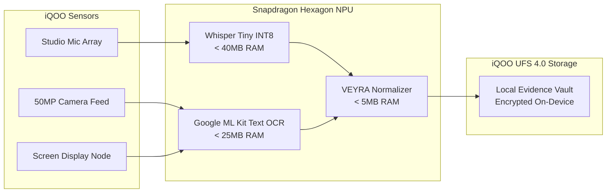

# NIA — iQOO Device Integration & Hardware Synergy Spec
> **Optimizing the Reality-Verified Personal Intelligence Layer for iQOO Flagship Smartphones**

---

## 📱 1. Strategic Target: The iQOO Flagship Architecture

NIA is specifically engineered as a **mobile-first, hardware-accelerated intelligence layer** targeting modern **iQOO smartphones** (including the iQOO 12, iQOO Neo 9 Pro, and future flagship lineups).

These devices represent an optimal compute platform due to three foundational hardware advantages:
1. **Snapdragon 8 Gen Series NPU (Hexagon Tensor Processor):** Unmatched on-device AI throughput for real-time quantized inference.
2. **High-Sampling Touch Digitizer (up to 2000Hz instantaneous touch response):** Enables ultra-low-latency multi-finger gesture recognition.
3. **SuperComputing Chip & VC Cooling:** Provides sustained, throttle-free performance during simultaneous camera vision processing and ambient transcription.

---

## ⚡ 2. Hardware Synergy Matrix

| iQOO Hardware Feature | NIA Capability Powered | User Experience Breakthrough |
| :--- | :--- | :--- |
| **Snapdragon NPU** | On-Device Whisper Tiny & ML Kit Vision OCR | Instant, zero-latency transcription without sending private voice/image data to cloud servers. |
| **Funtouch OS / OriginOS Multi-Touch** | **Mind Pulse** (3-Finger Swipe Up) | Intuitive situational awareness: swipe up anytime from any app to inspect on-screen reality. |
| **144Hz AMOLED Display** | **NIA Cinematic Orb** & Fluid Physics | 144 FPS smooth spring physics, dynamic neon glow, and instant tactile state transitions. |
| **Bionic Linear Motor (4D Haptics)** | Safe Action Gate & Wake Haptic Feedback | Tactile mechanical snap when reality drift is confirmed and when user approves remediations. |
| **Dual-Cell FlashCharge Architecture** | Battery-Conscious Concurrency Throttle | Models are lazy-loaded and sequentialized to avoid battery drain or thermal buildup. |

---

## 🧠 3. On-Device AI Acceleration & NPU Execution

NIA avoids the pitfall of generic cloud AI apps that stream raw voice and camera images to remote servers. All perceptual models run **100% on the iQOO phone**:



### Resource Budget & Safety Limits
- **RAM Footprint:** Combined active model memory stays strictly under **75 MB** on the phone.
- **Sequential Concurrency Guard:** Whisper and ML Kit never execute in parallel. The engine executes:
  `Capture -> Transcribe -> Free Audio Buffer -> OCR -> Free Frame Buffer -> VEYRA Evaluation`.
- **Zero Cloud Model Loading:** Backend on cloud Render is strictly configured to disallow heavy model weight downloads (`render_memory_safety_rule` test enforced).

---

## 👆 4. Mind Pulse & 3-Finger Gesture Architecture

One of NIA's marquee innovations is **Mind Pulse**, designed specifically for rapid context extraction on iQOO devices.

### Gesture Flow
1. **Trigger:** User performs a 3-finger upward swipe gesture across the screen.
2. **Capture:** The screen capture adapter retrieves active UI text elements (using Android `AccessibilityService` or `MediaProjection` in native builds; simulated screen buffer in Expo Go).
3. **Extraction:** Context extractor identifies events, locations, deadlines, and participants.
4. **Contrast:** VEYRA X compares the active screen context against NIA's digital ground truth.
5. **Presentation:** A lightweight overlay displays whether on-screen information is `VERIFIED_TRUE` or suffers from `REALITY_DRIFT`.

### Native vs. Sandbox Capabilities

```text
┌─────────────────────────────────────────────────────────────┐
│                    DUAL-MODE ADAPTER LAYER                   │
├──────────────────────────────┬──────────────────────────────┤
│    Expo Go Sandbox (Demo)    │   Native APK (iQOO Production)│
├──────────────────────────────┼──────────────────────────────┤
│ • In-app 3-finger detector   │ • System-wide Accessibility  │
│ • Deterministic screen mock  │ • Real MediaProjection API   │
│ • Foreground Orb trigger     │ • Always-on "Hey NIA" mic    │
│ • Simulated OCR fixture      │ • Native Google ML Kit OCR   │
│ • Zero installation barrier  │ • Full Funtouch OS synergy   │
└──────────────────────────────┴──────────────────────────────┘
```

---

## 🔒 5. Android & Funtouch OS Privacy Invariants

To meet stringent mobile security guidelines:
1. **Never Request Permissions Without Upfront Explanation:**
   NIA never presents a bare system permission dialog. The `SettingsScreen` presents a pre-flight education modal detailing *why* the permission is needed and confirming that data remains local.
2. **Never Silently Enable AccessibilityService:**
   Accessibility permissions must be manually granted by the user through Android System Settings. NIA never implies or attempts background exploitation.
3. **No Silent Ambient Audio Recording:**
   Microphone listening occurs only when the user invokes NIA or taps the Orb. Live captions provide visual confirmation of listening states.

---

## 🏁 6. Conclusion

By pairing the computational muscle of iQOO hardware with the deterministic intelligence of VEYRA X, NIA transforms the smartphone from a passive notification box into an **active guardian of personal reality**.
