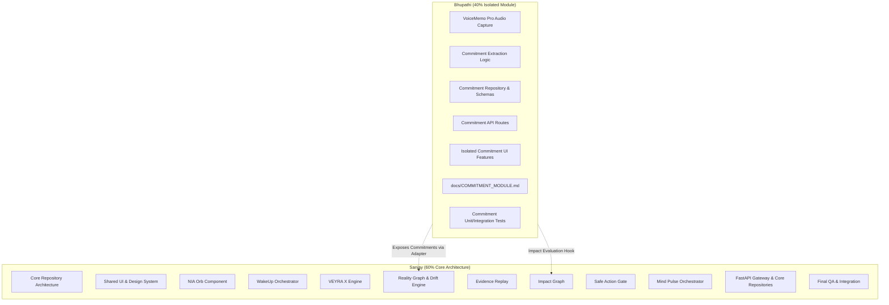

# NIA — Module Ownership & Division of Responsibility

This document defines the strict ownership contract between **Sanjay** (Core Platform & Reality Engine) and **Bhupathi** (VoiceMemo Pro & Commitment Intelligence).

---

## 1. Responsibility Matrix

---

## 2. Sanjay's Scope (60% Core System)

Sanjay is responsible for the overall foundational architecture and end-to-end reality verification lifecycle:

### Backend Files Owned:
* `backend/app/main.py`
* `backend/app/core/`
* `backend/app/api/` (except commitment-specific sub-routers)
* `backend/app/schemas/` (core domain contracts: reality, evidence, actions, timeline, wakeup)
* `backend/app/services/` (core VEYRA X services)
* `backend/app/repositories/` (digital state, evidence, timeline repositories)
* `backend/app/modules/reality/`
* `backend/app/modules/evidence/`
* `backend/app/modules/actions/`
* `backend/app/modules/digital_state/`
* `backend/app/modules/physical_observation/`

### Frontend Files Owned:
* `frontend/src/components/` (shared design primitives, NIA Orb)
* `frontend/src/theme/` (global colors, typography, styles)
* `frontend/src/navigation/` (global routing and modal overlays)
* `frontend/src/contracts/` (TypeScript domain definitions)
* `frontend/src/adapters/` (native hardware & simulation adapters)
* `frontend/src/features/reality/`
* `frontend/src/features/actions/`
* `frontend/src/features/timeline/`
* `frontend/src/features/mindPulse/`

---

## 3. Bhupathi's Scope (40% Isolated Module)

Bhupathi is responsible for the VoiceMemo Pro capture pipeline and natural language commitment intelligence:

### Backend Files Owned:
* `backend/app/modules/commitments/`
  - `models.py`
  - `schemas.py`
  - `extractor.py`
  - `repository.py`
  - `service.py`
  - `router.py`

### Frontend Files Owned:
* `frontend/src/features/commitments/` (isolated commitment list, status badges)
* `frontend/src/features/voiceMemo/` (audio recording, waveform visualizer, transcript display)

### Documentation & Tests Owned:
* `docs/COMMITMENT_MODULE.md`
* Commitment module test suites under `tests/backend/test_commitments.py`

---

## 4. Conflict Prevention Guidelines

1. **Isolation Guarantee:** Bhupathi does not touch `backend/app/main.py` or global router mounting directly. Sanjay provides a plug-and-play inclusion hook for `commitments_router`.
2. **Schema Uniformity:** Bhupathi's `Commitment` schema derives from the core `BaseModel` and exports the canonical `Commitment` contract defined in `backend/app/schemas/commitment.py`.
3. **No Direct UI Overrides:** Bhupathi's UI components must consume the tokens in `frontend/src/theme/` and atomic primitives from `frontend/src/components/` rather than defining bespoke conflicting global styling.
4. **Independent Testability:** The commitments module must be 100% testable in isolation without requiring active camera sensors or external mock devices.
