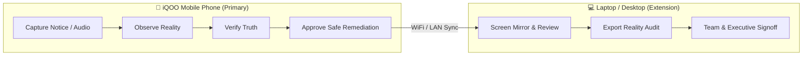

# NIA — Office Kit & Reality Audit Export Specification
> **Extending the Phone-First Reality Intelligence Layer to Laptop & Desktop Workflows**

---

## 💻 1. Core Product Principle: Phone Primary, Desktop Extension

A critical design requirement of NIA is:
> **The phone is the primary reality capture device. The laptop is an extension for review, screen mirroring, and report export.**

We deliberately do **NOT** build a desktop clone of NIA. Laptops do not possess the pocketable ubiquity, cameras, or ambient sensors necessary to capture reality shifts on the move. Instead, **Office Kit** provides the bridge between mobile reality capture and professional desktop workflows:



---

## 📄 2. The 10 Sections of the Reality Audit Report

The **Reality Audit Report** replaces chaotic technical log dumps with a structured, executive-ready document detailing the life cycle of a reality shift.

Every generated report contains exactly **10 canonical sections**:

```text
NIA REALITY AUDIT REPORT
├── 1. Session Information
├── 2. What NIA Knew (Digital Ground Truth)
├── 3. What Was Observed (Physical Sensor Feed)
├── 4. Reality Drift (Classification & Certainty)
├── 5. Evidence (Provenance & Snippets)
├── 6. Impact Cascade (Downstream Ripple)
├── 7. Proposed Action (Safe Remediation)
├── 8. User Approval (Explicit Human Consent)
├── 9. Action Result (Execution Status)
└── 10. Chronological Reality Timeline
```

### Detailed Breakdown of Sections

#### 1. Session Information
- Unique session tracking identifier (`sessionId`).
- Timestamp of audit generation.
- Hardware device identifier (`iQOO Neo / Android Prototype`).
- Execution runtime mode (`On-Device VEYRA X Reality Intelligence`).

#### 2. What NIA Knew (Digital Ground Truth)
- Target entity (`Final Presentation`).
- Known scheduled parameters (`Location: Room 204`, `Time: 09:00 AM`).
- Authoritative source (`Google Calendar (Synchronized)`).
- Last sync timestamp.

#### 3. What Was Observed (Physical Sensor Feed)
- Observed parameter (`Location: Room 302`).
- Physical provenance (`Camera / Notice Board OCR`).
- Raw text snippet (`"Presentations moved to Room 302 due to AC repair."`).
- Capture timestamp.

#### 4. Reality Drift
- Drift status (`REALITY_DRIFT`).
- Drift classification (`LOCATION_CHANGED`).
- Algorithmic confidence score (`0.96 / 96%`).
- Human-readable summary explaining the exact discrepancy.

#### 5. Evidence
- Structured list of physical and digital evidence items.
- Unique evidence IDs, source sensors, and cryptographic confidence scores.
- Local storage assurance (guaranteeing raw images remained on-device).

#### 6. Impact Cascade
- Downstream dependencies identified via Relational Graph Traversal:
  - Calendar event: *Final Presentation* (**HIGH** severity).
  - Prep reminder: *Check projector equipment* (**MEDIUM** severity).
  - Morning alarm: *Presentation wakeup* (**LOW** severity).
  - Handout commitment: *Bring printed handouts* (**MEDIUM** severity).

#### 7. Proposed Action
- Action identifier (`act-demo-room-update-001`).
- Action classification (`UPDATE_REMINDER`).
- Delta definition (`before: Room 204` $\to$ `proposed: Room 302`).
- Strict requirement tag: `approval_required: true`.

#### 8. User Approval
- Explicit human decision status (`APPROVED` or `REJECTED`).
- Approval timestamp.
- User identity (`Primary Device Owner`).
- Verification method (`Tactile Safe Action Gate Button Tap`).

#### 9. Action Result
- Mutation status (`SUCCEEDED`).
- Execution duration and adapter target (`MockReminderRepository` / Native Calendar).
- Confirmed post-action state (`Room 302`).

#### 10. Chronological Reality Timeline
- Chronological, immutable audit log of all transitions leading up to remediation.

---

## 📤 3. Multi-Format Export Capabilities

Office Kit enables seamless export across standard formats:
1. **GitHub Flavored Markdown:** Clean, portable text suitable for documentation, Slack, or GitHub issues.
2. **System Share Sheet Integration:** Native Android `Share.share()` intent to beam reports directly to email, WhatsApp, or Google Drive.
3. **Structured JSON:** Complete serialized schema for automated compliance or enterprise logging.
4. **Print / PDF Ready:** Formatted for instant conversion into presentation handouts or signoff sheets.

---

## 🔌 4. API Endpoints

```http
POST /api/v1/office-kit/generate-audit
Content-Type: application/json

{
  "session_id": "sess-hackathon-2026-demo"
}
```

**Response:**
```json
{
  "report": {
    "title": "NIA Reality Audit Report",
    "session": { "session_id": "sess-hackathon-2026-demo", ... },
    "what_nia_knew": { ... },
    "what_was_observed": { ... },
    "reality_drift": { ... },
    "evidence": [ ... ],
    "impact": [ ... ],
    "proposed_action": { ... },
    "approval": { ... },
    "result": { ... },
    "timeline": [ ... ]
  },
  "markdown": "# NIA REALITY AUDIT REPORT\n\n## 1. SESSION\n..."
}
```
