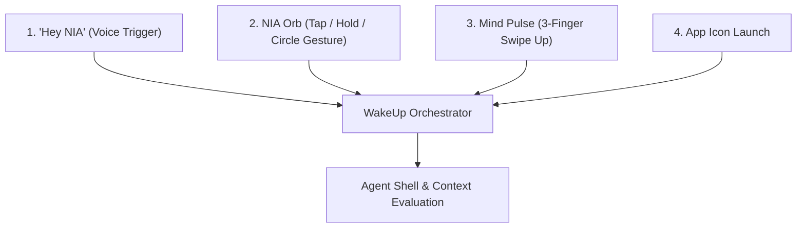

# NIA — Project Overview & Product Contract

## 1. Product Mission

**NIA** stands for **Natural Intelligence Assistant**.

The central philosophical question defining every capability in NIA is:
> **“Is what I know still true?”**

Human beings constantly maintain an internal model of reality: appointments, commitments, flight gates, deadlines, locations, and agreements. However, physical reality shifts asynchronously: physical paper notices get posted, verbal announcements are broadcast, and signs are updated without digital sync. NIA bridges this gap by acting as a **Reality-Verified Personal Intelligence Layer**.

---

## 2. What NIA Is vs. What NIA Is NOT

| NIA IS | NIA IS NOT |
| :--- | :--- |
| **A Phone-Native AI Assistant** running locally on device (iQOO phone) | **A generic conversational chatbot** with an endless text bubble stream |
| **A Reality-Verification Layer** cross-checking physical observations against digital state | **A CRUD dashboard** with manual state entry forms |
| **An Evidence-First Reasoning System** binding every fact to source, timestamp, and confidence | **An autonomous agent** that changes user calendar or reminder data silently |
| **A Safe-Action Gatekeeper** requiring explicit human confirmation for any external mutation | **A cloud-only AI service** that streams everything to multi-GB remote servers |
| **An honest platform citizen** utilizing adapters with graceful fallbacks | **An app that pretends Expo Go supports Android system services** |

---

## 3. The Core Hackathon Story

To demonstrate the full reality loop end-to-end under real-world conditions:

1. **Digital Ground Truth:** User's digital calendar contains an event: *“Final Presentation at 09:00 in Room 204”*.
2. **Physical Observation:** The user points the phone camera at a university notice board or hallway door. A printed sign reads: *“Notice: All Departmental Presentations Moved to Room 302 due to AC repair”*.
3. **Perception & Normalization:** NIA's on-device vision OCR extracts text and parses the entity (`Final Presentation`), property (`location`), and new value (`Room 302`).
4. **Drift Detection (VEYRA X):** VEYRA X compares digital ground truth (`Room 204`) with physical evidence (`Room 302`) and flags a `LOCATION_CHANGED` reality drift with confidence 0.94.
5. **Evidence Bundling:** NIA constructs an evidence item tying the raw camera frame snippet, OCR bounding box, timestamp, and calendar event ID.
6. **Impact Analysis:** Downstream dependencies are computed:
   - Calendar event: *Final Presentation* (Room 204)
   - Alarm: *Presentation Wakeup* (07:45)
   - Reminder: *Check equipment in Room 204* (08:30)
   - Commitment: *Meet teammates outside Room 204 at 08:45*
7. **Action Proposal:** NIA generates a non-destructive proposal: *“Update Final Presentation location from Room 204 to Room 302 and notify teammates.”*
8. **Safe Action Gate:** A high-visibility gate modal opens on the phone. The user reviews the before/after delta and evidence side-by-side. **Nothing changes until the user taps Approve.**
9. **Execution & Reality Timeline:** Upon approval, the calendar is safely patched. The event is written to the immutable **Reality Timeline**.
10. **Office Kit Export:** User can export a structured **Reality Audit Report** (PDF/Markdown) detailing the exact sequence of drift, evidence, and remediation.

---

## 4. Activation Pathways (WakeUp Orchestrator)

All 4 initiation triggers converge into a single, unified `WakeUpOrchestrator`:

1. **Voice Activation (“Hey NIA”):** Hands-free voice trigger routed to WakeUpOrchestrator.
2. **NIA Orb:** Persistent floating orb on phone screen. Tapping prompts instant verification; circular gesture activates situational scan.
3. **3-Finger Swipe Up (Mind Pulse):** Quick gesture evoking instant situational awareness ("What is changing around me right now?").
4. **App Icon:** Standard home screen launch entering full workspace.

---

## 5. Non-Negotiable Product Invariants

1. **Human Oversight is Mandatory:** No autonomous background modification of user calendars, reminders, or messages without explicit approval through the Safe Action Gate.
2. **Evidence-First Provenance:** Every claim presented by NIA must cite its evidence source (OCR text, audio transcript, digital calendar ID) with timestamp and confidence score.
3. **Deterministic Core:** VEYRA X reality comparisons, drift rules, and impact evaluations are deterministic code that works without requiring an LLM.
4. **Phone-First Local AI:** The phone (iQOO) is the primary computing device. Render backend does not run or host heavy multi-GB models.
5. **No Secrets or Weights in Git:** All secrets live in `.env` (ignored), and model weights remain on the device storage.
